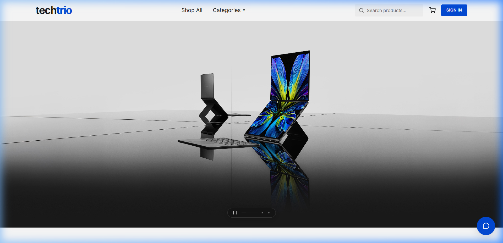
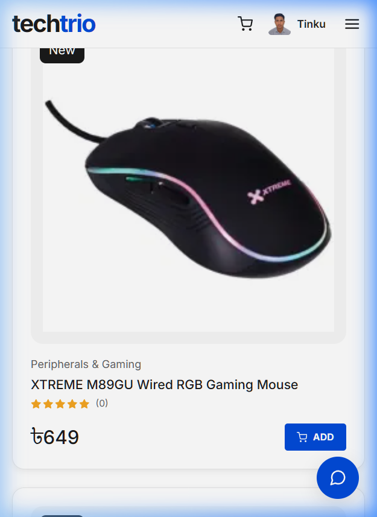
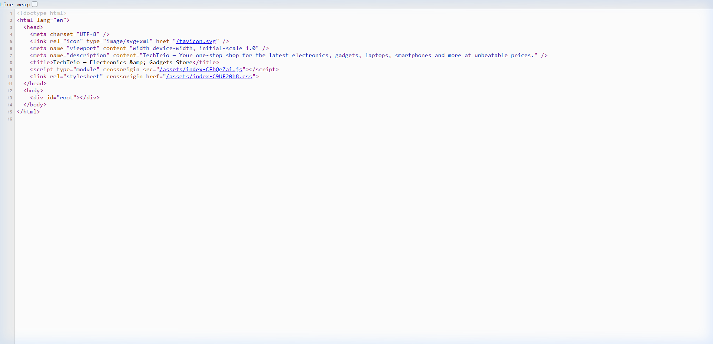
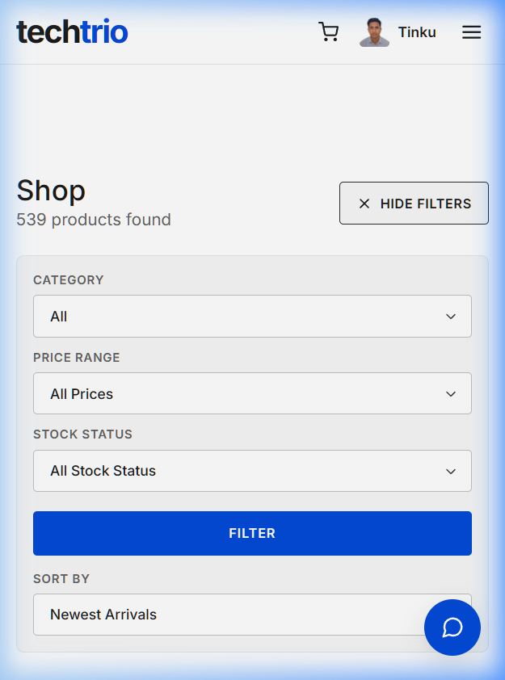
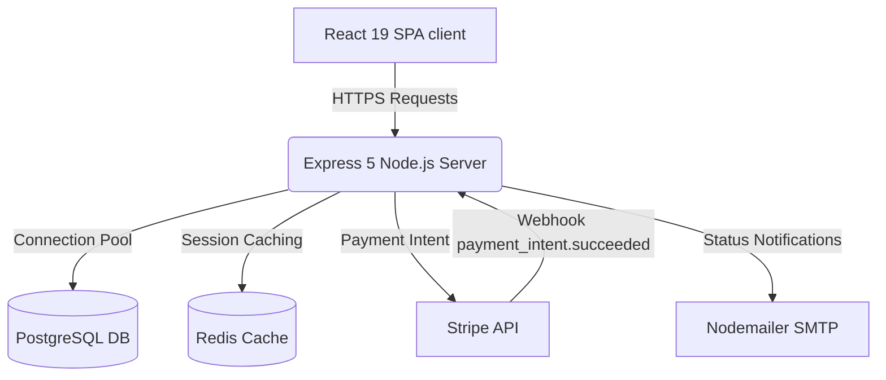

<div align="center">

# ✨ TechTrio — Premium Electronics & Gadgets Store

[](https://techtrio-nazim-riyadhs-projects.vercel.app/)
[](https://nodejs.org/)
[](https://www.postgresql.org/)
[](https://redis.io/)
[](https://stripe.com/)

---

**TechTrio** is a premium, enterprise-grade e-commerce application designed with a high-fidelity design system inspired by HP. The storefront features a white-paper layout, geometric typography, glassmorphism headers, and accent signal CTAs anchored in HP Electric Blue (`#024ad8`).

[Live Demo](https://techtrio-nazim-riyadhs-projects.vercel.app/) • [Deployment Manual](DEPLOYMENT.md) • [Design System Reference](DESIGN.md)

</div>

---

## 📸 Visual Gallery

Here is a visual overview of both customer storefront experiences and the admin panels on desktop and mobile.

### 🛒 Customer Storefront (Desktop & Mobile)

| 🖥️ Homepage (Desktop) | 📱 Shop Page (Mobile) |
| :---: | :---: |
|  |  |

---

### 📊 Management Dashboard (Desktop & Mobile)

| 🖥️ Administrative Orders (Desktop) | 📱 Order Details Card View (Mobile) |
| :---: | :---: |
|  |  |

---

## 🚀 Key Features

### 🛒 Customer Storefront & Checkout
- **Interactive Visual Stepper Timeline**: Customers can track their order lifecycle (`Processing` ➔ `Shipped` ➔ `Delivered`) via a responsive visual stepper on the profile page that scales beautifully down to 320px screen widths.
- **Dynamic Mobile Product Cards**: Redesigned product grid cards featuring custom padding scaling, clean typography, stacked pricing, and an expanded tap-to-select `Add to Cart` CTA on mobile viewports.
- **Secure Stripe Integration**: Streamlined payment entry utilizing Stripe Elements and automated webhooks validation (`payment_intent.succeeded`).
- **TechTrio AI Chatbot**: Interactive, streaming shopping assistant powered by server-side AI endpoints to help users discover catalog item specifications.
- **Horizontal Filtering & Sorting Bar**: Fast filtering by category, stock level, and custom search inputs.

### 📊 Administrative Control Center
- **Bento Grid Dashboard**: High-level statistical cards for Sales Volume, Daily Income, User Sign-ups, and Recharts Area charts rendering revenue progress.
- **Fulfillment Action Queue**: Priority-based "Processing Orders" task board enabling admins to mark shipments as dispatched or delivered instantly.
- **Products & Users Management**: Features dual-rendering capability: wide data tables for large viewports, and clean card lists for mobile, eliminating horizontal scrolling. Includes pagination controls on both views.
- **Stock Threshold Alerts**: Immediate dashboard banners warning administrative users when items fall below critical stock counts.

---

## 🧬 System Architecture

The following diagram illustrates how the frontend app communicates with the server, database, caching layer, and Stripe API:



---

## 🛠️ Technology Stack

| Component | Technology | Purpose |
| :--- | :--- | :--- |
| **Frontend** | React 19, Vite, React Router 7 | Core structure, routing, and lightning-fast development bundles |
| **Styling** | Vanilla CSS | White-paper minimalist design with Electric Blue accents |
| **Charts** | Recharts | Sales trends area analytics |
| **Backend** | Node.js, Express 5 | RESTful API server routing and session middleware |
| **Database** | PostgreSQL | Connection pooling, relational database, complex query indexing |
| **Caching** | Redis | Rate limiting and speed optimizations |
| **Payments** | Stripe SDK & Webhooks | Secure PCI-compliant customer transactions |
| **Emails** | Nodemailer | Transactional notifications (Processing, Shipped, Delivered) |

---

## ⚙️ Environment Configuration

Create a `config.env` file under `server/config/config.env` with these settings:

```env
PORT=4000
NODE_ENV=development
FRONTEND_URL=http://localhost:5173

# Authentication
JWT_SECRET_KEY=your_jwt_secret_key
JWT_EXPIRES_IN=30d
COOKIE_EXPIRES_IN=30

# Database Connection
DB_USER=postgres
DB_HOST=localhost
DB_PORT=5432
DB_PASSWORD=your_db_password
DB_NAME=TechTrio

# Redis Caching
REDIS_URL=redis://localhost:6379

# SMTP Mail Transport
SMTP_SERVICE=gmail
SMTP_HOST=smtp.gmail.com
SMTP_PORT=465
SMTP_MAIL=your_gmail_address
SMTP_PASSWORD=your_app_password

# Cloudinary
CLOUDINARY_CLIENT_NAME=your_cloudinary_name
CLOUDINARY_CLIENT_API=your_cloudinary_key
CLOUDINARY_CLIENT_SECRET=your_cloudinary_secret

# Stripe Payments
STRIPE_PUBLISHABLE_KEY=pk_test_...
STRIPE_SECRET_KEY=sk_test_...
STRIPE_WEBHOOK_SECRET=whsec_...
```

---

## 💻 Local Development

### 1. Database Setup
Ensure PostgreSQL and Redis are running on your system. Seeding will generate the tables, populate products, and configure the default admin account:
```bash
cd server
npm run seed:admin
```
* **Default Admin Credentials**: `admin@techtrio.com` / `Admin@123`

### 2. Start Backend Server
```bash
cd server
npm run dev
```

### 3. Start Frontend Storefront
```bash
cd client
npm run dev
```

### 4. Tunnel Stripe Webhook Events
To test credit card payment webhooks locally, boot the Stripe CLI listener:
```bash
stripe listen --forward-to localhost:4000/api/v1/payment/webhook
```

---

## 📄 License

Distributed under the MIT License. See [LICENSE](LICENSE) for details.
